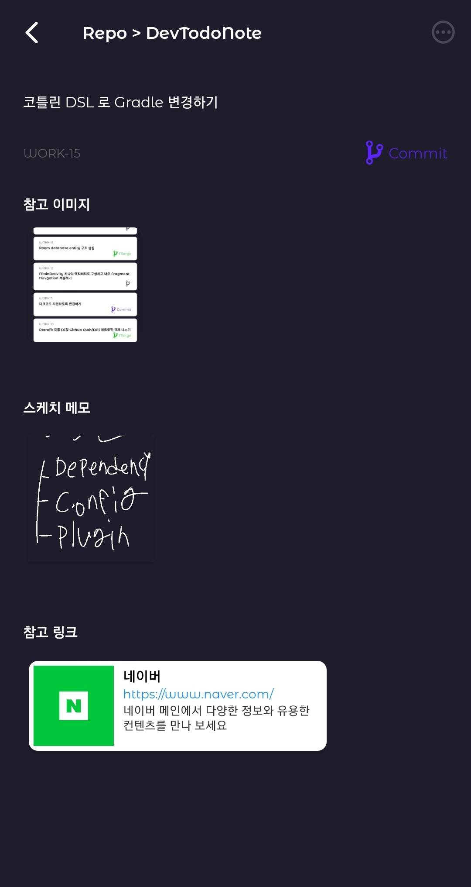
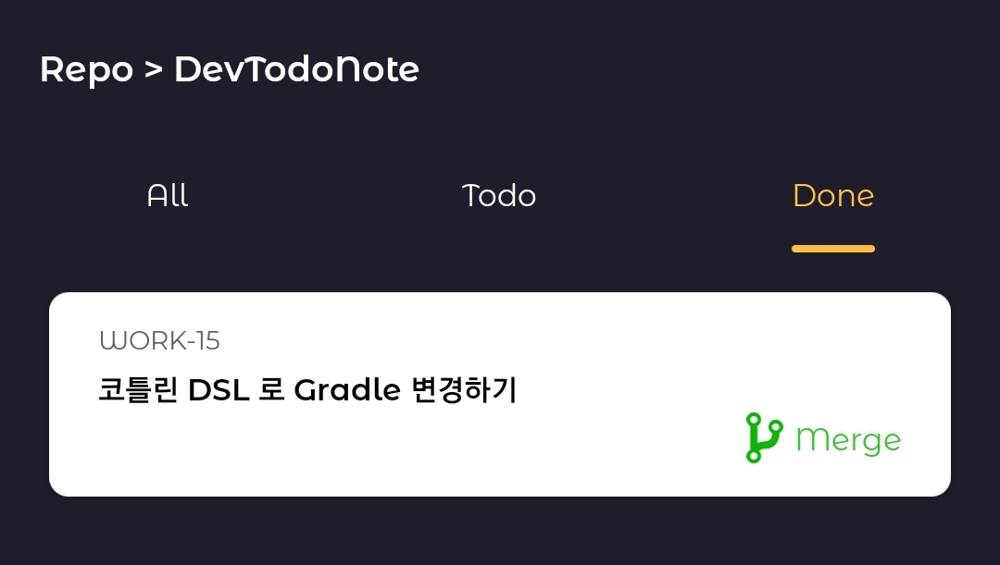

## DevTodoNote

## Github repository별 Todo List를 관리 할 수 있는 앱 입니다.

### 개발 동기
* 이런 경험이 다들 있으실거 같습니다.
  + 아까 그 코드는 이렇게 해결했으면 더 좋았을거 같다
    + 해결방안 > Todo 메모 작성
  + 이런 기능은 이런 로직으로 개발하는게 좋을거 같다
    + 해결 방안 > Todo 메모에 스케치 보드도 같이 추가
  + 이 링크는 나중에 개발할 때 참고하면 좋을 거 같으니 카톡에서 나에게 보내기에 저장 해놓고 깜빡함
    + 해결 방안 > Todo 메모에 참고 링크도 같이 추가

##### 개발중인 상황에서는 바로 도입해볼 수 있겠지만 그렇지 못한 상황이라면 메모장, 카카오톡 나에게 보내기 등등 자신만의 방법으로 작업을 저장해놓고 나중에 보면 정리가 안되어서 헷갈리는 문제점을 보완하고자 개발하게 되었습니다.

##### Jira를 사용해보신 분들이라면 Jira 티켓 정도로 생각하시면 좋습니다.

### 기술스택

* Kotlin
* MVVM
* Clean Architecture
* Dagger Hilt
* Jetpack Navigation component
* Room Database
* Lottie
* Retrofit

### 로그인

|로그인 화면|Github 로그인|
|:---:|:---:|
|||

### Github Repository 가져오기
##### 자신의 github repository를 가져온 후 repository를 클릭하여 Todo Note를 작성 할 수 있습니다.

### Repository별 Todo Note 리스트
##### 작성한 Todo list를 All, Todo, Done 으로 확인 할 수 있습니다. 

### Todo Note 작성
##### 해야 할 일을 작성 할 수 있습니다. 단순하게 메모만 작성하는 것이 아닌 참고 할만한 이미지, 간단한 아이디어 스케치, 참고 할 링크를 추가 할 수 있습니다.
##### (Todo 작성 시 오른쪽 하단에 보이는 브렌치명으로 브렌치를 생성하고 해당 브렌치를 commit, merge 시 자동 트리거)

|작성 화면|이미지 선택 화면|아이디어 스케치 추가|
|:---:|:---:|:---:|
||||

### Todo Viewer
##### 작성한 Todo를 완료한 후 티켓에 들어가면 자동으로 작업 내역을 파악하여 해당 브렌치의 상태를 자동으로 업데이트 합니다.

|Todo 티켓 자세히보기 화면|Todo 티켓 자동으로 Merge 스테이트로 변경된 화면|Todo List에서 자동으로 Done으로 넘어간 화면|
|:---:|:---:|:---:|
||||
