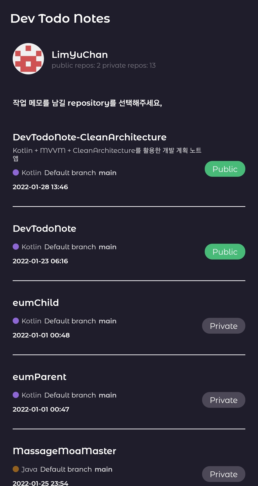

## DevTodoNote

## Github repository별 Todo List를 관리 할 수 있는 앱 입니다.

### 기술스택

* Kotlin
* MVVM
* Clean Architecture
* Dagger Hilt
* Jetpack Navigation component
* Room Database
* Lottie
* Retrofit

### 로그인

|로그인 화면|Github 로그인|
|:---:|:---:|
|||

### Github Repository 가져오기
##### 자신의 github repository를 가져온 후 repository를 클릭하여 Todo Note를 작성 할 수 있습니다.

### Repository별 Todo Note 리스트
##### 작성한 Todo list를 All, Todo, Done 으로 확인 할 수 있습니다. 

